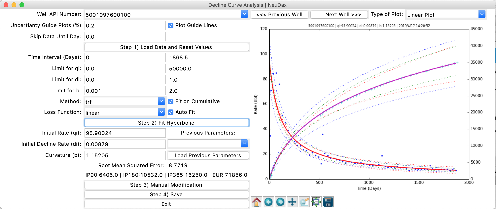
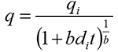

# Decline Curve Analysis Tool
> A Tool for Petroleum Engineers to
> Do Decline Curve Analysis Quickly

Decline Curve Analysis is a process of fitting an analytical curve (exponential, harmonic or hyperbolic) to production history data. This analysis is important for characterizing the performance of each well as well as forecasting the production in future.

For this tool, a hyperbolic model (most general DCA model) is used. 

Using robust curve fitting and optimization tools in Python, the code finds the best DCA parameters. The estimated parameters are

1) qi: Initial Production Rate
2) di: Initial Decline Rate
3) b: Hyperbolic Exponent

## Running the Code

Please run this code using a Python complier like Spyder. This tool use TKinter library for the frontend.
